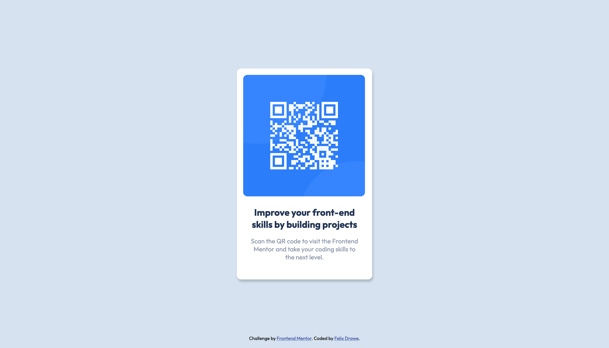

# Frontend Mentor - QR code component solution

This is a solution to the [QR code component challenge on Frontend Mentor](https://www.frontendmentor.io/challenges/qr-code-component-iux_sIO_H).

## Table of contents
- [Screenshot](#screenshot)
- [Links](#links)
- [Built with](#built-with)
- [Author](#author)

### Screenshots

## Desktop

## Mobile

### Links

- Solution URL: [Add solution URL here](https://your-solution-url.com)
- Live Site URL: [Add live site URL here](https://your-live-site-url.com)

### Built with

- Semantic HTML5 markup
- CSS custom properties
- Flexbox

### Useful resources

- [Andreas Remdt Youtube](https://www.youtube.com/watch?v=ANOz2JJqcgc&t=354s) 
- A very simple challenge but the video helped me to refactor my code 
- Use CSS Variables
- Converting Type from ttf to woff2

## Author

- Website - [Felix Drawe](https://www.felixdrawe.de)
- Frontend Mentor - [Felix Drawe](https://www.frontendmentor.io/profile/Felixdrawe)

